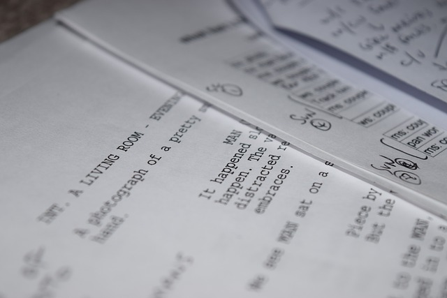

<!-- Proyectos -->
  <!--<section  class="container mt-5">
        <h2 class="text-center">MÓDULOS</h2>
        <div class="row">
            <div class="col-md-3">
                <div class="card">
                    
                    <div class="card-body">
                        <h5 class="card-title">Estilos</h5>
                        <a href="./vistas/estilos.html" class="btn btn-primary">Ver Más</a>
                    </div>
                </div>
            </div>
            <div class="col-md-3">
                <div class="card">
                    
                    <div class="card-body">
                        <h5 class="card-title">guiones</h5>
                        <a href="./vistas/guiones.html" class="btn btn-primary">Ver Más</a>
                    </div>
                </div>
            </div>
            <div class="col-md-3">
                <div class="card">
                    
                    <div class="card-body">
                        <h5 class="card-title">Produccion</h5>
                        <a href="./vistas/produccion.html" class="btn btn-primary">Ver Más</a>
                    </div>
                </div>
            </div>
            <div class="col-md-3">
                <div class="card">
                    
                    <div class="card-body">
                        <h5 class="card-title">Edicion</h5>
                        <a href="./vistas/edicion.html" class="btn btn-primary">Ver Más</a>
                    </div>
                </div>
            </div>
        </div>
  </section> -->
 


<!-- dashboard -->
<!--  <nav class="navbar navbar-expand-lg navbar-dark px-5 ">
        <a class="navbar-brand" href="../vistas/dashboard.html">
           
        </a>
        <button
          class="navbar-toggler"
          type="button"
          data-bs-toggle="collapse"
          data-bs-target="#navbarNav"
          aria-controls="navbarNav"
          aria-expanded="false"
          aria-label="Toggle navigation"
        >
          <span class="navbar-toggler-icon"></span>
        </button>
        <div class="collapse navbar-collapse " id="navbarNav">
          <div class="container d-flex "> 
          <ul class="navbar-nav ms-auto  pt-4 "> 
            <li class="nav-item dropdown ">
              <a class="nav-link dropdown-toggle" href="#" role="button" data-bs-toggle="dropdown" aria-expanded="false">
                Modulos
              </a>
              <ul class="dropdown-menu  ">
                <li><a class="dropdown-item" href="../vistas/estilos.html">Estilos</a></li>
                <li><a class="dropdown-item" href="../vistas/guiones.html">guiones</a></li>
                <li><a class="dropdown-item" href="../vistas/produccion.html">Produccion</a></li>
                <li><a class="dropdown-item" href="../vistas/edicion.html">Edicion</a></li>
              </ul>
            </li>
            <li class="nav-item"><a class="nav-link" href="./vistas/quienes-somos.html">Nosotros</a></li>
            <li class="nav-item">
              <a class="nav-link " href="#">Certificación</a>
            </li>
            <li class="nav-item"><a class="nav-link" href="./vistas/noticias.html">Blog</a></li>
          </ul>

          <li class="nav-item dropdown ">
            <a class="nav-link dropdown-toggle" href="#" role="button" data-bs-toggle="dropdown" aria-expanded="false">
              <i class="fa-regular fa-circle-user "></i>
            </a>

            

            <ul class="dropdown-menu ">
              <li><h5 id="saludo"></h5></li>
              <li><a class="dropdown-item" href="./cerrando.html">
                <button class="btn btn-outline-info">cerrar
              sesion</button></a></li>
            </ul>
          </li>

         </div>          
        </div>
  </nav> -->

  <!-- <div class="offcanvas offcanvas-end" id="demo">
    <div class="offcanvas-header">
      <h1 class="offcanvas-title">Heading</h1>
      <button type="button" class="btn-close" data-bs-dismiss="offcanvas"></button>
    </div>
    <div class="offcanvas-body">
      <p>Some text lorem ipsum.</p>
      <p>Some text lorem ipsum.</p>
      <p>Some text lorem ipsum.</p>
      <button class="btn btn-secondary" type="button">A Button</button>
    </div>
  </div>
  
  <div class="container-fluid mt-3">
    <h3>Offcanvas Sidebar</h3>
    <p>Offcanvas is similar to modals, except that it is often used as a sidebar.</p>
    <button class="btn btn-warning" type="button" data-bs-toggle="offcanvas" data-bs-target="#demo">
      Open Offcanvas Sidebar
    </button>
  </div> -->


<!--   .profile-userpic img {
  float: none;
  margin: 0 auto;
  height: 60%;
  width: 60%;
  -webkit-border-radius: 50% !important;
  -moz-border-radius: 50% !important;
  border-radius: 60% !important;
} -->


<div> 
<h2> Lo que aprenderás </h2>

<p> Técnicas para involucrar mejor a la audiencia a un nivel subconsciente</p>

<p>Por qué la elección del color es tan importante y cómo afecta a diferentes emociones</p>

<p>Significado de diferentes Ángulos y Movimientos de Cámara</p>

<p>Cómo la Iluminación crea diferentes estados de ánimo</p>

<p>Cómo el Sonido / Música / Silencio crean Emoción</p>

<p>Entender por qué la Ubicación y la Decoración de Escenarios son tan importantes para crear la atmósfera adecuada</p>

<p>¿Qué significa tener música Dentro de la película o Fuera?</p>

<p>¿Qué es el Efecto Kuleshov y cómo se aplica a la música?</p>

<p>Cómo crear películas con más significado y emoción</p>

</div>


main modules 


<main class="bg-dark">

    <!-- Sección de Inicio -->
    <div id="inicio" class="text-center py-2 " style="background-image: url('') ;
       background-repeat: no-repeat;background-position: center; object-fit: contain; height:200px;">
      
    </div>

    <!-- Sección de Introducción -->
    <div class="ingresovideos  text-center py-5 ">
      <h1 class="fw-bold text-body-dark">GUIONES</h1>
      <p class="lead">Recorrido por las principales tendencias y exponentes del cine </p>
    </div>

    <!-- <div class="container col-8
     mt-5 "> -->
      <!-- Barra de progreso -->
      <!-- <div class="info-avance row container  ">
        <p class="texto-informacion col  text-light" style="font-style: italic; "> Alcanza tu meta</p>
        <i class="fa-solid fa-flag col fs-4 text-warning  text-end"></i>
      </div>
      <div class="col m-auto">
        <div class="progress  ">

          <div class="progress-bar bg-success " role="progressbar" style="width: 20%" aria-valuenow="50"
            aria-valuemin="0" aria-valuemax="100">
            20%
          </div>
        </div>
      </div>
    </div> -->


    <div class="container col-8
     mt-5 ">
     <!-- Barra de progreso -->
     <!-- <div class="progress mt-3">
      <div
        id="barraProgreso"
        class="progress-bar"
        role="progressbar"
        style="width: 0%"
        aria-valuenow="0"
        aria-valuemin="0"
        aria-valuemax="100"
      ></div>
    </div> -->
  </div>


    <section class="newModel pb-4 py-5">
      <!-- start acordeon model -->

      <div id="carouselExample " class="carousel slide " data-bs-ride="false">
        <div class="carousel-inner">
          <!-- Panel 1 -->
          <div class="carousel-item active">


          </div>

          <div class="container col-lg-8 pb-2">

            <div class="accordion container p-0 col-lg-12 col-md-12 col-sm-12 " id="accordionPanelsStayOpenExample">
              <div class="accordion-item text-light flex-wrap">
                <div class="nuevocontent">
                  <h2 class="accordion-header col-12" id="panelsStayOpen-headingOne">
                    <button class="accordion-button d-flex flex-wrap" type="button" data-bs-toggle="collapse"
                      data-bs-target="#panelsStayOpen-collapseOne" aria-expanded="true"
                      aria-controls="panelsStayOpen-collapseOne">
                      <div class="otroContent col-12 my-2 ">


                        <!-- video bar avance -------------------------------------------------------------->                        
                        <div class="video-yt">
                          <!-- Video -->
                          <video id="miVideo" width="100%" controls>
                            <source src="https://media.istockphoto.com/id/1474014782/video/acting-script-and-screenplay-for-workplace-theater.mp4?s=mp4-640x640-is&k=20&c=XDerH6wix_s_992NJupEHbD6XtW4oDJg4GSTaDiVrXQ="
                              type="video/mp4" />
                            Tu navegador no soporta video HTML5.
                          </video>
                        </div>

                        <!-- <div class="video-yt">
                <div class="col-12 text-light justify-content-center m-auto border " >
                  <iframe class="col-12 m-auto justify-content-center  " height="700px" src="https://www.youtube.com/embed/UFz_qyMOwsA" title="This is How You Practice Cinematography (All By Yourself)" 
                  frameborder="0" allow="accelerometer; autoplay; clipboard-write; encrypted-media;
                   gyroscope; picture-in-picture; web-share" referrerpolicy="strict-origin-when-cross-origin" allowfullscreen></iframe>

          </div>
              </div> -->
                        
                        
                        <div class="contenedor text-center   ">
                          <div class="info-video mt-5">
                            <p> DESCUBRE: ¿Cómo comenzar en la produccion cinematografica?</p>
                            <p>Nuestro segundo nivel, comienza en compañía de nuestros héroes.</p>
                            
                          </div>
  
                          <div class="container col-8
       mt-5 ">
        <!-- Barra de progreso -->
        <div class="progress  ">
          <div id="barraProgreso" class="progress-bar" role="progressbar" style="width: 0%" aria-valuenow="0"
            aria-valuemin="0" aria-valuemax="100"></div>
        </div>
      </div>
    </div>


                    </button>
                  </h2>
                </div>
                <div id="panelsStayOpen-collapseOne" class="accordion-collapse collapse show"
                  aria-labelledby="panelsStayOpen-headingOne">
                  <!-- <div class="accordion-body">
              <strong>This is the first item's accordion body.</strong> It is
              shown by default, until the collapse plugin adds the appropriate
              classes that we use to style each element. These classes control
              the overall appearance, as well as the showing and hiding via CSS
              transitions. You can modify any of this with custom CSS or
              overriding our default variables. It's also worth noting that just
              about any HTML can go within the <code>.accordion-body</code>,
              though the transition does limit overflow.
            </div> -->

                  <!-- card 1 -------------------------------------------------------------------------------------------->

                  <div class="card mb-3 px-1 col-lg col-md-12 col-sm-12">
                    <div class="row g-0">
                      <div class="infoavance d-flex">
                        <!-- start progress bar -->
                        <div class="col-8 justify-content-center m-auto pt-4 align-item-center">
                          <!-- <div class="progress d-flex col justify-content-start my-1">
                            <div class="progress-bar bg-success" role="progressbar" style="width: 20%"
                              aria-valuenow="30" aria-valuemin="0" aria-valuemax="100">
                              20%
                            </div>
                          </div> -->
                        </div>
                        <!-- end progress bar -->

                        <!-- checkbox-start -->
                        <!-- <div class="form-check mx-1 pt-4  justify-content-center col-2">
                          <input class="form-check-input" type="checkbox" value="" id="flexCheckDefault" />
                          <label class="form-check-label text-ends" for="flexCheckDefault">
                            End
                          </label>

                        </div> -->

                        <!-- checkbox-end-->

                      </div>
                      <div class="col-md-10 col-sm-12 m-auto py-4   ">
                        <div class="card-body">
                          <h5 class="card-title">
                            Video: Introducción al Guion Cinematográfico
                          </h5>
                          <p class="card-text">
                            lead-in to additional content. This content is a little
                            bit longer
                          </p>
                          <p class="card-text">
                            <small class="text-body-secondary">Last updated 3 mins ago</small>
                          </p>

                          <!-- Button trigger modal ------------------------------------------------------------------------------------------------------------------------>
                          <!--  <button
              type="button"
              class="btn btn-primary   mx-2 mb-2   "
              data-bs-toggle="modal"
              data-bs-target="#staticBackdrop"
            >
              Launch static backdrop modal
            </button> -->


                        </div>
                      </div>
                    </div>


                    <!-- Modal -->
                    <div class="modal fade modal-sm" id="staticBackdrop" data-bs-backdrop="static"
                      data-bs-keyboard="false" tabindex="-1" aria-labelledby="staticBackdropLabel" aria-hidden="true">
                      <div class="modal-dialog modal-lg">
                        <div class="modal-content">
                          <div class="modal-header">
                            <h1 class="modal-title fs-5" id="staticBackdropLabel">
                              Modal title
                            </h1>
                            <button type="button" class="btn-close" data-bs-dismiss="modal" aria-label="Close"></button>
                          </div>


                          <div class="modal-body">
                            ...

                          </div>
                          <div class="col-12 col-md-12 col-sm-12">
                            <div>
                              <iframe class="col-12 col-md-12 col-sm-12" height="700" class="border"
                                src="https://www.youtube.com/embed/SMmfzHEOjAQ"
                                title="Animación Artes UdeA #7| Chiwaia Guia" frameborder="0" allow="accelerometer; autoplay; clipboard-write; encrypted-media; 
                    gyroscope; picture-in-picture; web-share" referrerpolicy="strict-origin-when-cross-origin"
                                allowfullscreen></iframe>
                            </div>
                            <div class="row text-center">
                              <div class="col-12 col-sm-12">
                                <p style="
                                height: 300px;
    
                                width: 80%;
                                overflow: scroll;
                                margin: auto;
                              ">

                                </p>
                              </div>
                            </div>
                          </div>

                          <div class="modal-footer">
                            <button type="button" class="btn btn-secondary" data-bs-dismiss="modal">
                              Close
                            </button>
                            <button type="button" class="btn btn-primary">
                              Understood
                            </button>
                          </div>
                        </div>
                      </div>
                    </div>

                    <!-- end modal -->
                  </div>

                  <!-- end card -->
                </div>
              </div>

              <div class="accordion-item">
                <h2 class="accordion-header" id="panelsStayOpen-headingTwo">
                  <button class="accordion-button collapsed" type="button" data-bs-toggle="collapse"
                    data-bs-target="#panelsStayOpen-collapseTwo" aria-expanded="false"
                    aria-controls="panelsStayOpen-collapseTwo">
                    <p class="px-3">EXPLORA</p>

                  </button>
                </h2>
                <div id="panelsStayOpen-collapseTwo" class="accordion-collapse collapse"
                  aria-labelledby="panelsStayOpen-headingTwo">
                  <div class="accordion-body">
                    <div class="info-video px-3 col-10 py-4 m-auto ">
                      <p> EXPLORA</p>
                      <p>Nuestro primer nivel, comienza en compañía de nuestros héroes.</p>
                      <p>Aquí obtendrás recursos de descarga para complementar nuestro curso </p>
                    </div>
                  </div>
                </div>
              </div>
              <div class="accordion-item  ">
                <h2 class="accordion-header" id="panelsStayOpen-headingThree">
                  <button class="accordion-button collapsed" type="button" data-bs-toggle="collapse"
                    data-bs-target="#panelsStayOpen-collapseThree" aria-expanded="false"
                    aria-controls="panelsStayOpen-collapseThree">
                    <p class="px-3"> REVIVE</p>

                  </button>
                </h2>
                <div id="panelsStayOpen-collapseThree" class="accordion-collapse collapse"
                  aria-labelledby="panelsStayOpen-headingThree">
                  <div class="accordion-body">
                    <p>
                    <div class="info-video px-3 col-10 m-auto py-4">
                      <p>REVIVE</p>
                      <p>Esta es tu gran reto, descifra con nosotros los diferentes momentos que le dan sentido a la
                        historia de la animación.</p>
                      <p>Desarrolla nuestro test, en pocos minutos encuentra preguntas que te serviran para seguir
                        adelante</p>
                    </div>
                    </p>
                  </div>
                </div>
              </div>
            </div>
          </div>

        </div>

        <!-- Panel 2 -->
        <div class="carousel-item ">
          <div class="container col-lg-8 col-md-10 col-sm-12">
            <div class="accordion" id="accordionExample2">
              <div class="accordion-item">
                <h2 class="accordion-header" id="headingTwo">
                  <button class="accordion-button" type="button" data-bs-toggle="collapse" data-bs-target="#collapseTwo"
                    aria-expanded="true" aria-controls="collapseTwo">
                    Accordion Item #2
                  </button>
                </h2>
                <div id="collapseTwo" class="accordion-collapse collapse show" aria-labelledby="headingTwo"
                  data-bs-parent="#accordionExample2">
                  <div class="accordion-body">
                    <p>Contenido del segundo acordeón.</p>
                  </div>
                </div>
              </div>
            </div>
          </div>
        </div>

        <!-- Panel 3 -->
        <div class="carousel-item">
          <div class="container col-lg-8 col-md-10 col-sm-12">
            <div class="accordion" id="accordionExample3">
              <div class="accordion-item">
                <h2 class="accordion-header" id="headingThree">
                  <button class="accordion-button" type="button" data-bs-toggle="collapse"
                    data-bs-target="#collapseThree" aria-expanded="true" aria-controls="collapseThree">
                    Accordion Item #3
                  </button>
                </h2>
                <div id="collapseThree" class="accordion-collapse collapse show" aria-labelledby="headingThree"
                  data-bs-parent="#accordionExample3">
                  <div class="accordion-body">
                    <p>Contenido del tercer acordeón.</p>
                  </div>
                </div>
              </div>
            </div>
          </div>
        </div>
      </div>

      <!-- Controles del Carousel -->
      <!--  <button class="carousel-control-prev" type="button" data-bs-target="#carouselExample" data-bs-slide="prev">
        <span class="carousel-control-prev-icon" aria-hidden="true"></span>
        <span class="visually-hidden">Previous</span>
      </button>
      <button class="carousel-control-next" type="button" data-bs-target="#carouselExample" data-bs-slide="next">
        <span class="carousel-control-next-icon" aria-hidden="true"></span>
        <span class="visually-hidden">Next</span>
      </button>
    </div> -->

    </section>


  </main>


  ANTIGUO MAIN MODULOS 

  <main class="bg-dark">

      <!-- Sección de Inicio -->
      <div id="inicio" class="text-center py-2 " style="background-image: url('') ;
       background-repeat: no-repeat;background-position: center; object-fit: contain; height:200px;" >
        
      </div>
  
      <!-- Sección de Introducción -->
      <div class="ingresovideos  text-center py-5 ">
        <h1 class="fw-bold text-body-dark">EDICIÓN</h1>
        <p class="lead">Recorrido por las principales tendencias y exponentes del septimo arte, El cine </p>
      </div>
  
      <div class="container col-8
       mt-5 ">
        <!-- Barra de progreso -->
        <div class="info-avance row container  ">
          <p class="texto-informacion col  text-light" style="font-style: italic; "> Alcanza tu meta</p>
          <i class="fa-solid fa-flag col fs-4 text-warning  text-end"></i>
        </div>
        <div class="col m-auto">
        <div class="progress  ">
  
          <div class="progress-bar bg-success " role="progressbar" style="width: 20%" aria-valuenow="50" aria-valuemin="0"
            aria-valuemax="100">
            20%
          </div>
        </div>
      </div>
      </div>
  
  
    <section class="newModel pb-4 py-5">
      <!-- start acordeon model -->
        
      <div id="carouselExample " class="carousel slide " data-bs-ride="false">
        <div class="carousel-inner">
          <!-- Panel 1 -->
           <div class="carousel-item active"> 
            
  
            </div>
  
      <div class="container col-lg-8 pb-2" > 
    
        <div class="accordion container p-0 col-lg-12 col-md-12 col-sm-12 "
          id="accordionPanelsStayOpenExample"
        >
          <div class="accordion-item text-light flex-wrap">
            <div class="nuevocontent">
              <h2 class="accordion-header col-12" id="panelsStayOpen-headingOne">
                <button
                  class="accordion-button d-flex flex-wrap"
                  type="button"
                  data-bs-toggle="collapse"
                  data-bs-target="#panelsStayOpen-collapseOne"
                  aria-expanded="true"
                  aria-controls="panelsStayOpen-collapseOne"
                >
                  <div class="otroContent col-12 my-2 ">
  
                  <div class="video-yt">
                  <div class="col-12 text-light justify-content-center m-auto border " >
                    <iframe class="col-12 m-auto justify-content-center  " height="700px" src="https://www.youtube.com/embed/UFz_qyMOwsA" title="This is How You Practice Cinematography (All By Yourself)" 
                    frameborder="0" allow="accelerometer; autoplay; clipboard-write; encrypted-media;
                     gyroscope; picture-in-picture; web-share" referrerpolicy="strict-origin-when-cross-origin" allowfullscreen></iframe>
  
            </div>
                </div>
                    <div class="info-video px-3 col-12 py-4">
                    <p > DESCUBRE: ¿Cómo comenzar en la produccion cinematografica?</p>
                    <p>Nuestro primer nivel, comienza en compañía de nuestros héroes.</p>
                  </div>
                    
                   
                  
                </button>
              </h2>
            </div>
            <div
              id="panelsStayOpen-collapseOne"
              class="accordion-collapse collapse show"
              aria-labelledby="panelsStayOpen-headingOne"
            >
              <!-- <div class="accordion-body">
                <strong>This is the first item's accordion body.</strong> It is
                shown by default, until the collapse plugin adds the appropriate
                classes that we use to style each element. These classes control
                the overall appearance, as well as the showing and hiding via CSS
                transitions. You can modify any of this with custom CSS or
                overriding our default variables. It's also worth noting that just
                about any HTML can go within the <code>.accordion-body</code>,
                though the transition does limit overflow.
              </div> -->
  
              <!-- card 1 -------------------------------------------------------------------------------------------->
  
              <div class="card mb-3 px-1 col-lg col-md-12 col-sm-12">
                <div class="row g-0">
                <div class="infoavance d-flex">
                <!-- start progress bar -->
                <div class="col-8 justify-content-center m-auto pt-4 align-item-center">
                  <div
                    class="progress d-flex col justify-content-start my-1"
                  >
                    <div
                      class="progress-bar bg-success"
                      role="progressbar"
                      style="width: 20%"
                      aria-valuenow="30"
                      aria-valuemin="0"
                      aria-valuemax="100"
                    >
                      20%
                    </div>
                  </div>
                </div>
                <!-- end progress bar -->
  
                <!-- checkbox-start -->
                <div class="form-check mx-1 pt-4  justify-content-center col-2">
                  <input
                    class="form-check-input"
                    type="checkbox"
                    value=""
                    id="flexCheckDefault"
                  />
                  <label
                    class="form-check-label text-ends"
                    for="flexCheckDefault"
                  >
                    End
                  </label>
  
                </div>
  
                <!-- checkbox-end-->
                
              </div>
                  <div class="col-md-10 col-sm-12 m-auto py-4   ">
                    <div class="card-body">
                      <h5 class="card-title">
                        Video: Introducción al Guion Cinematográfico
                      </h5>
                      <p class="card-text">
                        lead-in to additional content. This content is a little
                        bit longer
                      </p>
                      <p class="card-text">
                        <small class="text-body-secondary"
                          >Last updated 3 mins ago</small
                        >
                      </p>
  
                       <!-- Button trigger modal ------------------------------------------------------------------------------------------------------------------------>
               <!--  <button
                type="button"
                class="btn btn-primary   mx-2 mb-2   "
                data-bs-toggle="modal"
                data-bs-target="#staticBackdrop"
              >
                Launch static backdrop modal
              </button> -->
  
                      
                    </div>
                  </div>
                </div>
  
               
  
                <!-- Modal -->
                <div
                  class="modal fade modal-sm"
                  id="staticBackdrop"
                  data-bs-backdrop="static"
                  data-bs-keyboard="false"
                  tabindex="-1"
                  aria-labelledby="staticBackdropLabel"
                  aria-hidden="true"
                >
                  <div class="modal-dialog modal-lg">
                    <div class="modal-content">
                      <div class="modal-header">
                        <h1 class="modal-title fs-5" id="staticBackdropLabel">
                          Modal title
                        </h1>
                        <button
                          type="button"
                          class="btn-close"
                          data-bs-dismiss="modal"
                          aria-label="Close"
                        ></button>
                      </div>
  
  
                     <div class="modal-body" >
                  ...
                  
                </div> 
                        <div class="col-12 col-md-12 col-sm-12">
                          <div>
                            <iframe
                              class="col-12 col-md-12 col-sm-12"
                              height="700"
                              class="border"
                              src="https://www.youtube.com/embed/SMmfzHEOjAQ"
                              title="Animación Artes UdeA #7| Chiwaia Guia"
                              frameborder="0"
                              allow="accelerometer; autoplay; clipboard-write; encrypted-media; 
                      gyroscope; picture-in-picture; web-share"
                              referrerpolicy="strict-origin-when-cross-origin"
                              allowfullscreen
                            ></iframe>
                          </div>
                          <div class="row text-center">
                            <div class="col-12 col-sm-12">
                              <p
                                style="
                                  height: 300px;
      
                                  width: 80%;
                                  overflow: scroll;
                                  margin: auto;
                                "
                              >
                                
                              </p>
                            </div>
                        </div>
                      </div>
  
                      <div class="modal-footer">
                        <button
                          type="button"
                          class="btn btn-secondary"
                          data-bs-dismiss="modal"
                        >
                          Close
                        </button>
                        <button type="button" class="btn btn-primary">
                          Understood
                        </button>
                      </div>
                    </div>
                  </div>
                </div>
  
                <!-- end modal -->
              </div>
  
              <!-- end card -->
            </div>
          </div>
  
          <div class="accordion-item">
            <h2 class="accordion-header" id="panelsStayOpen-headingTwo">
              <button
                class="accordion-button collapsed"
                type="button"
                data-bs-toggle="collapse"
                data-bs-target="#panelsStayOpen-collapseTwo"
                aria-expanded="false"
                aria-controls="panelsStayOpen-collapseTwo"
              >
              <p class="px-3">EXPLORA</p>
              
              </button>
            </h2>
            <div
              id="panelsStayOpen-collapseTwo"
              class="accordion-collapse collapse"
              aria-labelledby="panelsStayOpen-headingTwo"
            >
              <div class="accordion-body">
                <div class="info-video px-3 col-10 py-4 m-auto ">
                  <p > EXPLORA</p>
                  <p>Nuestro primer nivel, comienza en compañía de nuestros héroes.</p>
                  <p>Aquí obtendrás recursos de descarga para complementar nuestro curso </p>
                </div>
              </div>
            </div>
          </div>
          <div class="accordion-item  ">
            <h2 class="accordion-header" id="panelsStayOpen-headingThree">
              <button
                class="accordion-button collapsed"
                type="button"
                data-bs-toggle="collapse"
                data-bs-target="#panelsStayOpen-collapseThree"
                aria-expanded="false"
                aria-controls="panelsStayOpen-collapseThree"
              >
              <p class="px-3"> REVIVE</p>
               
              </button>
            </h2>
            <div
              id="panelsStayOpen-collapseThree"
              class="accordion-collapse collapse"
              aria-labelledby="panelsStayOpen-headingThree"
            >
              <div class="accordion-body">
                <p>
                  <div class="info-video px-3 col-10 m-auto py-4">
                    <p>REVIVE</p>
                    <p >Esta es tu gran reto, descifra con nosotros los diferentes momentos que le dan sentido a la historia de la animación.</p>
                    <p>Desarrolla nuestro test, en pocos minutos encuentra preguntas que te serviran para seguir adelante</p>
                  </div>
                </p>
              </div>
            </div>
          </div>
        </div>
          </div>
  
        </div>
      
          <!-- Panel 2 -->
          <div class="carousel-item ">
            <div class="container col-lg-8 col-md-10 col-sm-12">
              <div class="accordion" id="accordionExample2">
                <div class="accordion-item">
                  <h2 class="accordion-header" id="headingTwo">
                    <button class="accordion-button" type="button" data-bs-toggle="collapse" data-bs-target="#collapseTwo" aria-expanded="true" aria-controls="collapseTwo">
                      Accordion Item #2
                    </button>
                  </h2>
                  <div id="collapseTwo" class="accordion-collapse collapse show" aria-labelledby="headingTwo" data-bs-parent="#accordionExample2">
                    <div class="accordion-body">
                      <p>Contenido del segundo acordeón.</p>
                    </div>
                  </div>
                </div>
              </div>
            </div>
          </div>
      
          <!-- Panel 3 -->
          <div class="carousel-item">
            <div class="container col-lg-8 col-md-10 col-sm-12">
              <div class="accordion" id="accordionExample3">
                <div class="accordion-item">
                  <h2 class="accordion-header" id="headingThree">
                    <button class="accordion-button" type="button" data-bs-toggle="collapse" data-bs-target="#collapseThree" aria-expanded="true" aria-controls="collapseThree">
                      Accordion Item #3
                    </button>
                  </h2>
                  <div id="collapseThree" class="accordion-collapse collapse show" aria-labelledby="headingThree" data-bs-parent="#accordionExample3">
                    <div class="accordion-body">
                      <p>Contenido del tercer acordeón.</p>
                    </div>
                  </div>
                </div>
              </div>
            </div>
          </div>
        </div>
      
        <!-- Controles del Carousel -->
        <!--  <button class="carousel-control-prev" type="button" data-bs-target="#carouselExample" data-bs-slide="prev">
          <span class="carousel-control-prev-icon" aria-hidden="true"></span>
          <span class="visually-hidden">Previous</span>
        </button>
        <button class="carousel-control-next" type="button" data-bs-target="#carouselExample" data-bs-slide="next">
          <span class="carousel-control-next-icon" aria-hidden="true"></span>
          <span class="visually-hidden">Next</span>
        </button>
      </div> -->
  
    </section>
  
  
  
  
  
  
    </main>


#### Manejo de Promesas de Video
```javascript
// Función segura para reproducir videos
async function playVideoSafely(video, index) {
    try {
        if (video.readyState >= 2) {
            video.playbackRate = 0.9;
            await video.play();
        }
    } catch (error) {
        console.warn(`Error reproduciendo video: ${error.message}`);
    }
}
```

#### IntersectionObserver para Visibilidad
- Los videos se reproducen automáticamente cuando están visibles en pantalla
- Se pausan cuando salen del área visible
- Optimiza el rendimiento y ahorra recursos

#### Políticas de Autoplay
- Manejo correcto de errores `NotAllowedError`
- Reproducción después de interacción del usuario
- Compatibilidad con navegadores móviles

## Estructura del Proyecto

```
Look/
├── assets/          # Recursos multimedia (videos, imágenes)
├── css/            # Estilos CSS
├── js/             # Scripts JavaScript
├── vistas/         # Páginas HTML
├── index.html      # Página principal
├── index.js        # Script principal con carrusel mejorado
└── README.md       # Este archivo
```

## Tecnologías Utilizadas
- HTML5
- CSS3
- JavaScript (ES6+)
- Bootstrap 5
- Font Awesome

## Instalación y Uso

1. Clona el repositorio
2. Abre `index.html` en tu navegador
3. Los videos del carrusel se reproducirán automáticamente después de la interacción del usuario

## Solución de Problemas

### Videos no se reproducen en GitHub Pages
- Los videos ahora manejan correctamente las políticas de autoplay
- Se requiere interacción del usuario para iniciar la reproducción
- Implementación robusta de manejo de errores

### Problemas de Rendimiento
- Los videos se pausan automáticamente cuando no están visibles
- Carga optimizada con `preload="metadata"`
- Manejo eficiente de recursos del navegador

## Contribución
Para contribuir al proyecto:
1. Fork el repositorio
2. Crea una rama para tu feature
3. Commit tus cambios
4. Push a la rama
5. Abre un Pull Request

## Licencia
Este proyecto está bajo la Licencia MIT.
